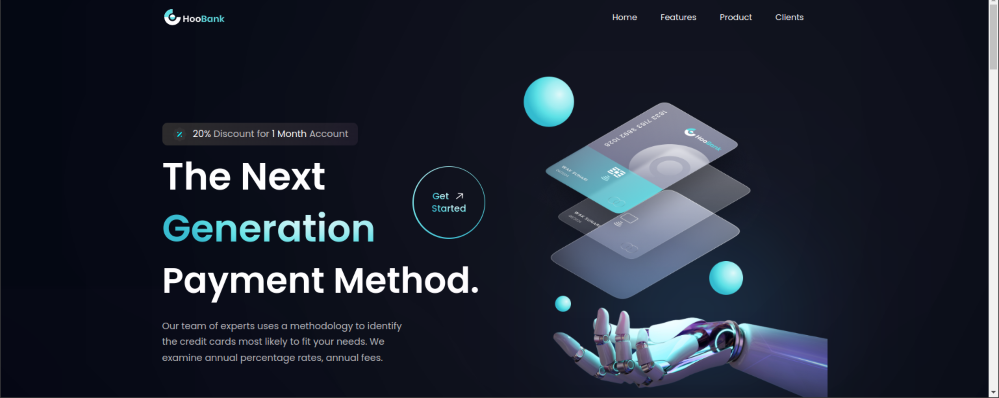
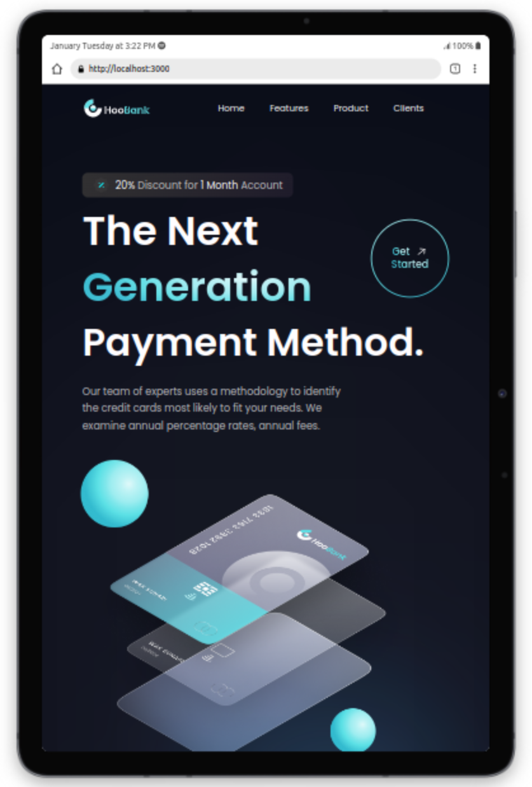
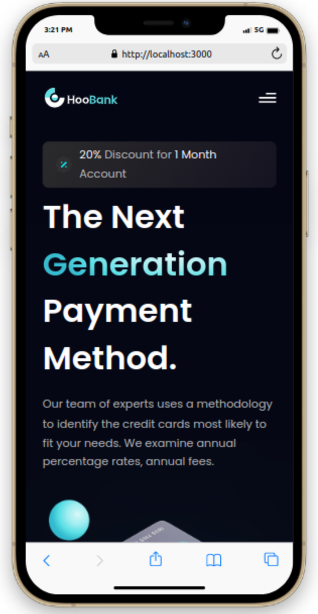

# HooBank Website

     
     
     

This project is a frontend single page website of a bank. 
The figma design is by JS-Mastery. I made a few changes on the design to make the website fully responsive and visually appealing on all devices.

### Technologies:

- React
- Tailwind CSS
- Firebase Hosting

#### Deployment

The live website is deployed and hosted on firebase. You can find the link to the live website below.

[Live Website](https://openai-gpt3.web.app)

#### Key Lessons Learnt:

- Responsive web design with Tailwind CSS
- React Props
- React useState
- Reuseable Components
- Standard React file/folder structure
